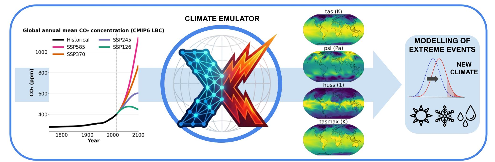

# ClimX: A Challenge for Extreme-Aware Climate Model Emulation



ClimX focuses on emulating high-resolution daily climate outputs from the NorESM2-MM Earth System Model, with special emphasis on accurately reproducing climate extremes (e.g., heatwaves, droughts, and extreme precipitation), not just mean climate behavior.

## At a glance

- **Core task:** Predict daily, 1° resolution climate variables from greenhouse gas and aerosol forcings.
- **Submission rule:** Models must predict the daily target variables first; leaderboard indices must be computed from those outputs.
- **Data:** Full dataset (~200GB, Hugging Face) and lightweight prototype dataset (<1GB, Kaggle).
- **Evaluation:** Region-wise nNSE averaged across 15 extreme climate indices.
- **Test setting:** Held-out SSP2-4.5 scenario.
- **Optional track:** Probabilistic predictions are evaluated with CRPS on a separate Kaggle UQ track.

## Getting started (recommended)

For this repository, using **mamba** is recommended for faster and more reliable environment solves.

```bash
# one-time: install mamba into base conda
conda install -n base -c conda-forge mamba

# create the environment from this repo
mamba env create -f environment.yml
conda activate clima_emu_new
```

Then launch Jupyter and open `playground.ipynb`:

```bash
jupyter notebook
```

## Playground and key files

- `playground.ipynb`: End-to-end notebook for data loading, preprocessing, training baseline models, evaluation, Kaggle submission formatting, and result visualization.
- `environment.yml`: Full Python environment specification used by the notebook and training scripts.
- `train.py`: Script-based baseline training workflow (useful when you prefer Python scripts over notebooks).
- `src/`: Core code for preprocessing, models, metrics, utilities, and evaluation helpers.

## Official challenge links

- Kaggle main track: https://www.kaggle.com/competitions/climx
- Kaggle UQ track: https://www.kaggle.com/competitions/clim-x-uq-track
- Hugging Face dataset: https://huggingface.co/datasets/isp-uv-es/ClimX
- Website: https://ipl-uv.github.io/ClimX/

## Sponsorship

ClimX is supported by ESA Phi-lab, which sponsors the challenge prizes and travel support for winning teams.


