# Gnn Baseline Model Results

Here are the latest results after running the baseline gnn model on the `ssp245` test scenario.

### Kaggle Score

| Metric | Score |
|---|---|
| nNSE (↑) | -0.482060 |

### Quantitative Results

| Variable                             |     R² |
|:-------------------------------------|-------:|
| `tas` (Near-Surface Air Temperature) |  0.545 |
| `tasmax` (Daily Max Temperature)     |  0.514 |
| `tasmin` (Daily Min Temperature)     |  0.534 |
| `pr` (Precipitation)                 | -0.084 |
| `huss` (Specific Humidity)           |  0.467 |
| `psl` (Sea Level Pressure)           |  0.176 |
| `sfcWind` (Surface Wind Speed)       |  0.121 |

**Climate Extreme Indices Metrics:**

| Index   | Description   | Unit   |    RMSE |       R2 |
|:--------|:--------------|:-------|--------:|---------:|
| FD      | FD            |        |  10.228 |   -4.46  |
| SU      | SU            |        |  11.395 |   -0.563 |
| ID      | ID            |        |   8.987 |   -1.255 |
| TR      | TR            |        |   9.308 |   -0.412 |
| GSL     | GSL           |        |  12.083 |   -0.382 |
| TXX     | TXX           |        |   4.157 |   -0.481 |
| TNN     | TNN           |        |   4.195 |   -0.327 |
| WSDI    | WSDI          |        |  94.055 |  -56.336 |
| CSDI    | CSDI          |        |   3.331 |   -0.129 |
| RX5DAY  | RX5DAY        |        |  34.589 |   -2.17  |
| CDD     | CDD           |        | 202.794 | -916.76  |
| CWD     | CWD           |        |  85.508 | -609.721 |
| R95P    | R95P          |        |   0.004 |   -9.783 |
| SDII    | SDII          |        |   4.448 |  -63.006 |
| R10MM   | R10MM         |        |  22.533 |  -11.731 |

### Visual Results

The visualizations for spatial maps and time series comparisons are generated within the `playground.ipynb` notebook. Below are all visuals from `gnn_visuals/`.
#### Spatial Comparison Maps

<table>
  <tr>
<td align="center"><b>result_map_huss_2015-02-20.png</b></td>
<td align="center"><b>result_map_pr_2015-02-20.png</b></td>
  </tr>
  <tr>
<td>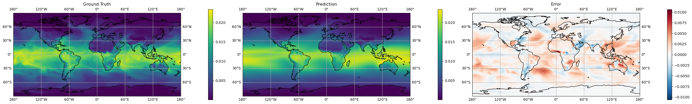</td>
<td>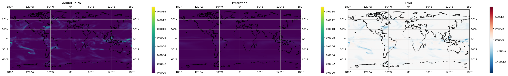</td>
  </tr>
  <tr>
<td align="center"><b>result_map_psl_2015-02-20.png</b></td>
<td align="center"><b>result_map_sfcWind_2015-02-20.png</b></td>
  </tr>
  <tr>
<td>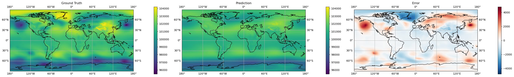</td>
<td>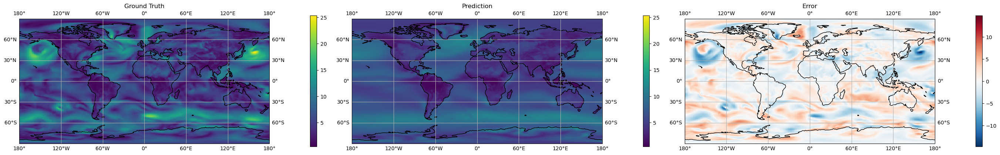</td>
  </tr>
  <tr>
<td align="center"><b>result_map_tas_2015-02-20.png</b></td>
<td align="center"><b>result_map_tasmax_2015-02-20.png</b></td>
  </tr>
  <tr>
<td>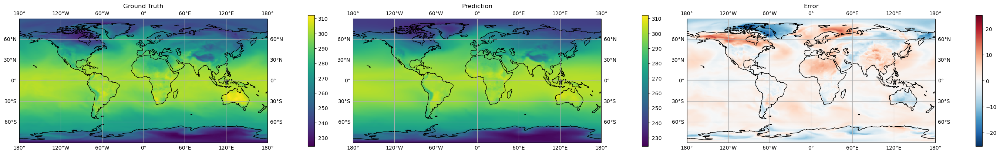</td>
<td>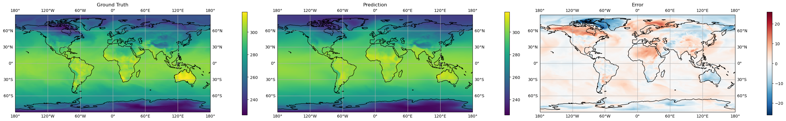</td>
  </tr>
  <tr>
<td align="center"><b>result_map_tasmin_2015-02-20.png</b></td>
<td align="center"></td>
  </tr>
  <tr>
<td>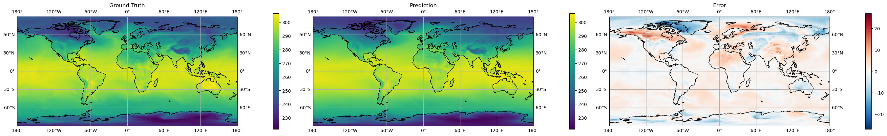</td>
<td></td>
  </tr>
</table>

#### Time Series Comparisons

<table>
  <tr>
<td align="center"><b>result_timeseries_huss_40.0_-95.0.png</b></td>
<td align="center"><b>result_timeseries_pr_40.0_-95.0.png</b></td>
  </tr>
  <tr>
<td>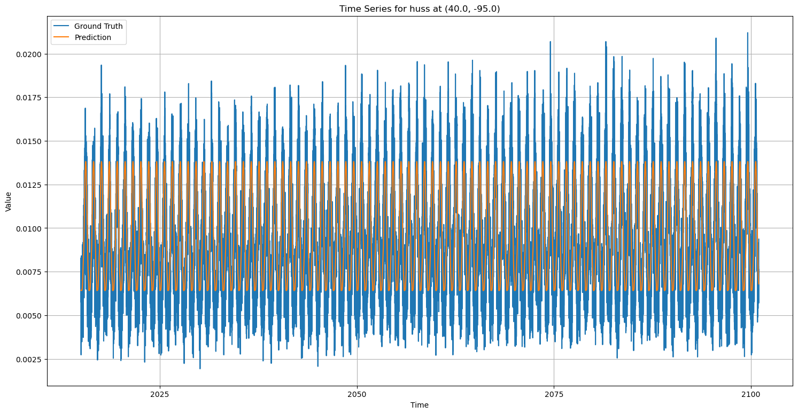</td>
<td>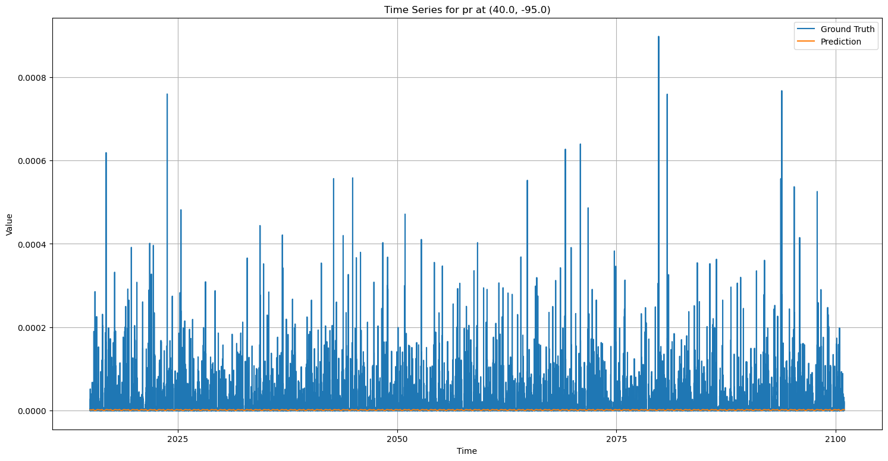</td>
  </tr>
  <tr>
<td align="center"><b>result_timeseries_psl_40.0_-95.0.png</b></td>
<td align="center"><b>result_timeseries_sfcWind_40.0_-95.0.png</b></td>
  </tr>
  <tr>
<td>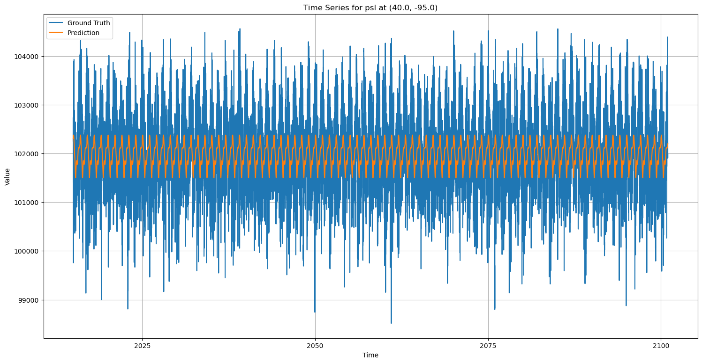</td>
<td>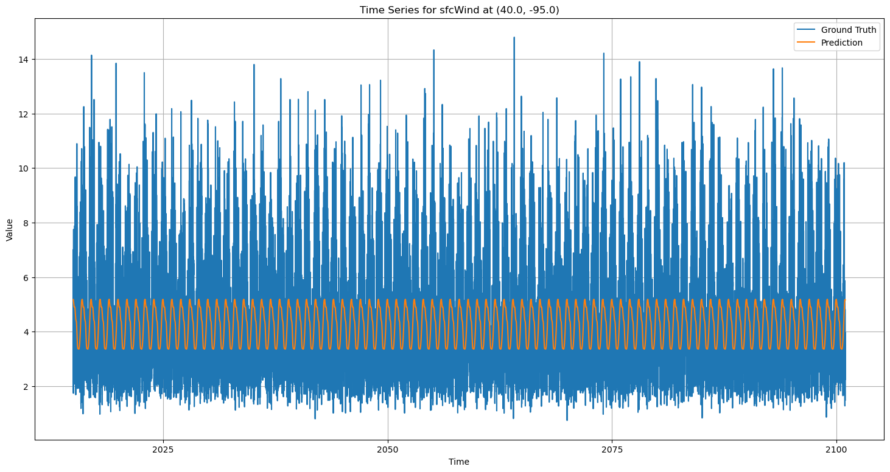</td>
  </tr>
  <tr>
<td align="center"><b>result_timeseries_tas_40.0_-95.0.png</b></td>
<td align="center"><b>result_timeseries_tasmax_40.0_-95.0.png</b></td>
  </tr>
  <tr>
<td>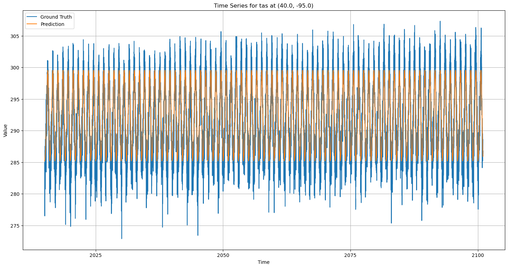</td>
<td>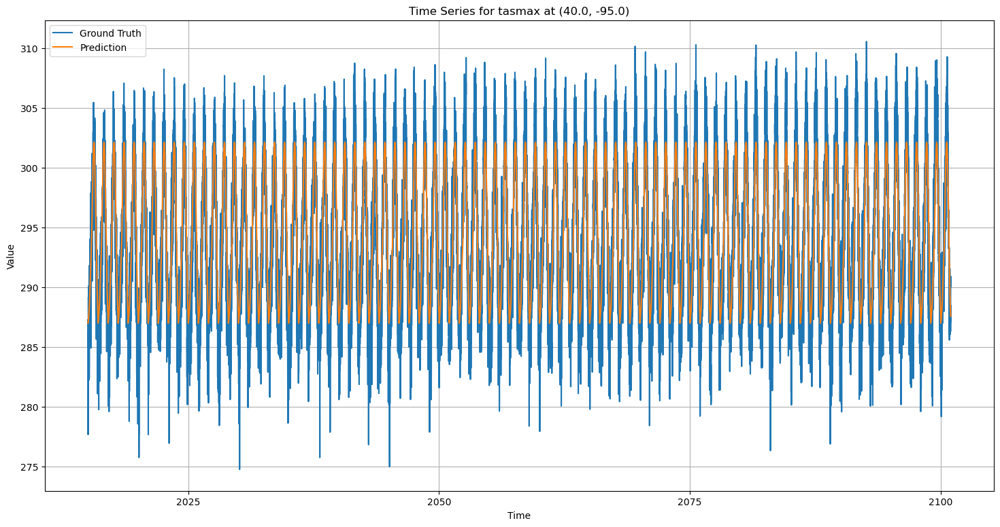</td>
  </tr>
  <tr>
<td align="center"><b>result_timeseries_tasmin_40.0_-95.0.png</b></td>
<td align="center"></td>
  </tr>
  <tr>
<td>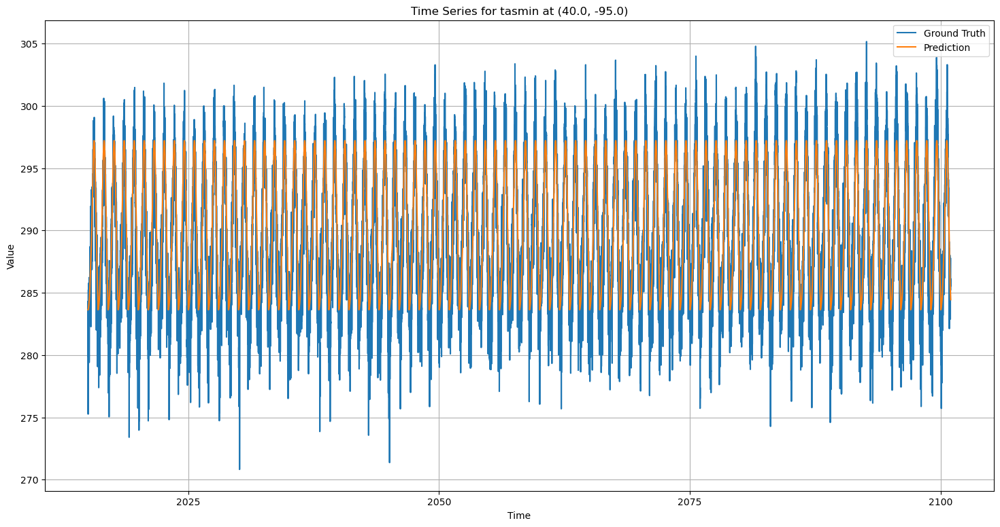</td>
<td></td>
  </tr>
</table>

#### Scatter Plots

<table>
  <tr>
<td align="center"><b>result_scatter_huss_2015-02-20.png</b></td>
<td align="center"><b>result_scatter_pr_2015-02-20.png</b></td>
  </tr>
  <tr>
<td>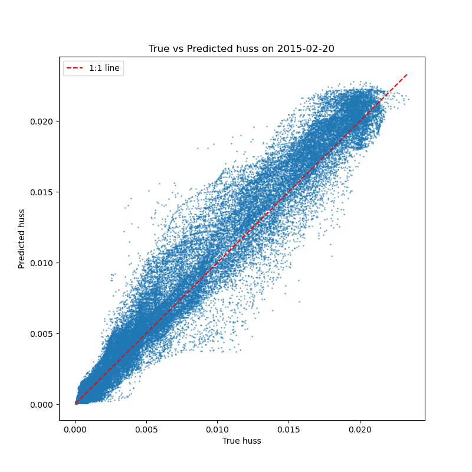</td>
<td>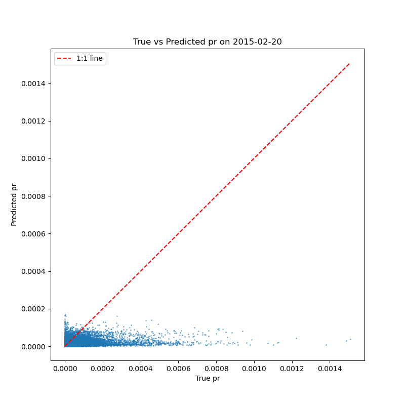</td>
  </tr>
  <tr>
<td align="center"><b>result_scatter_psl_2015-02-20.png</b></td>
<td align="center"><b>result_scatter_sfcWind_2015-02-20.png</b></td>
  </tr>
  <tr>
<td>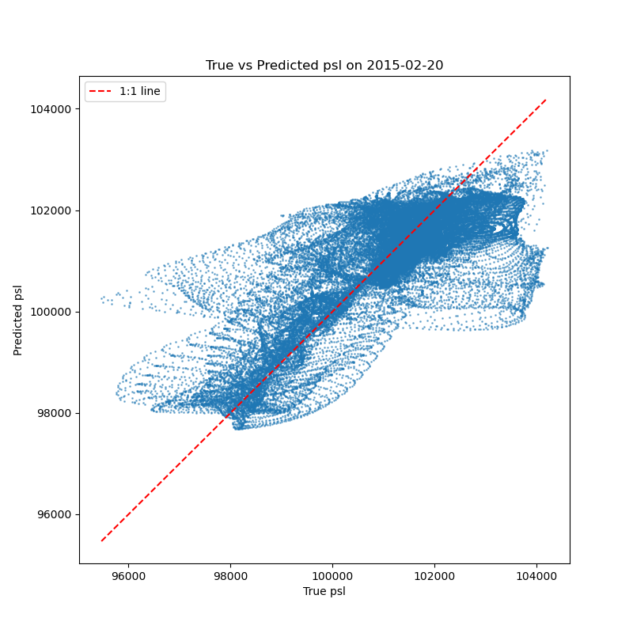</td>
<td>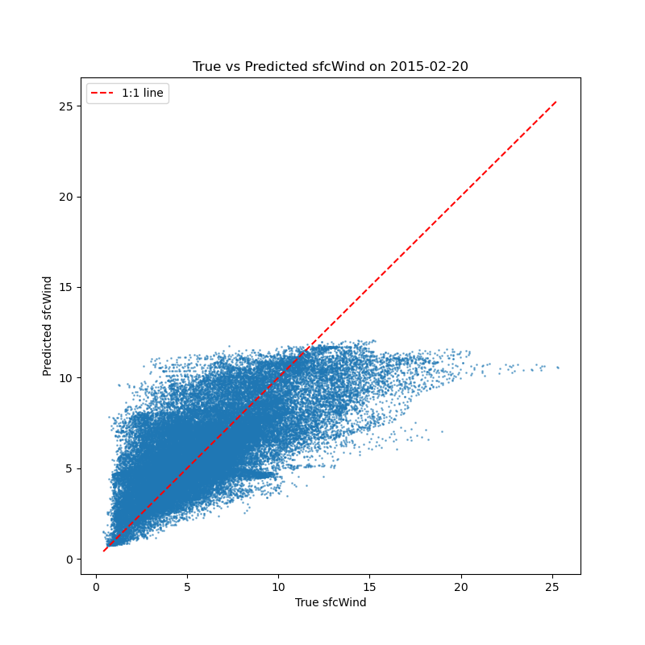</td>
  </tr>
  <tr>
<td align="center"><b>result_scatter_tas_2015-02-20.png</b></td>
<td align="center"><b>result_scatter_tasmax_2015-02-20.png</b></td>
  </tr>
  <tr>
<td>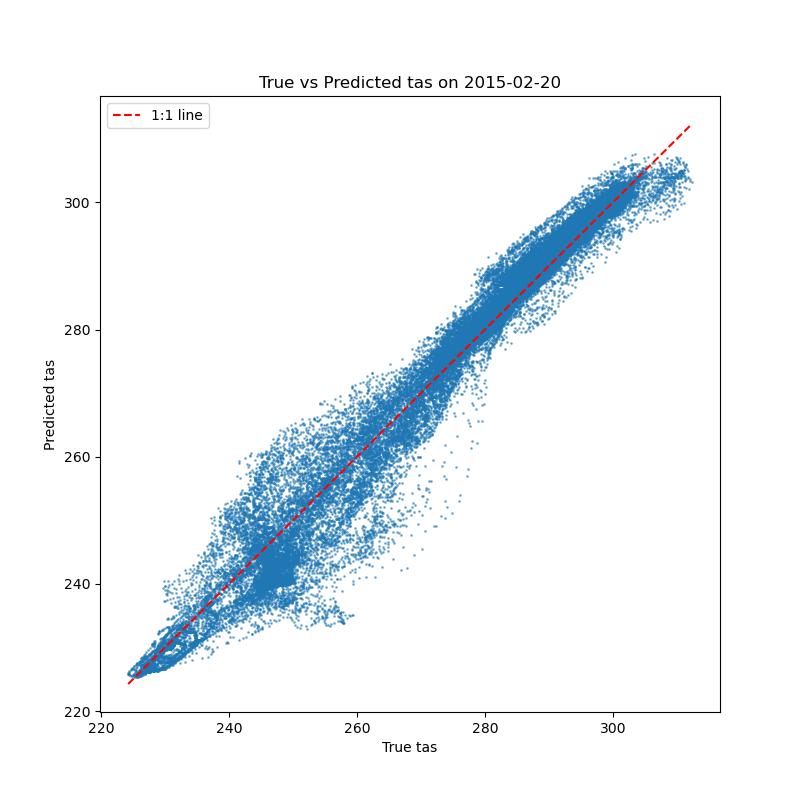</td>
<td>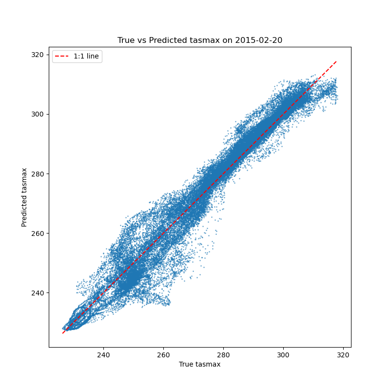</td>
  </tr>
  <tr>
<td align="center"><b>result_scatter_tasmin_2015-02-20.png</b></td>
<td align="center"></td>
  </tr>
  <tr>
<td>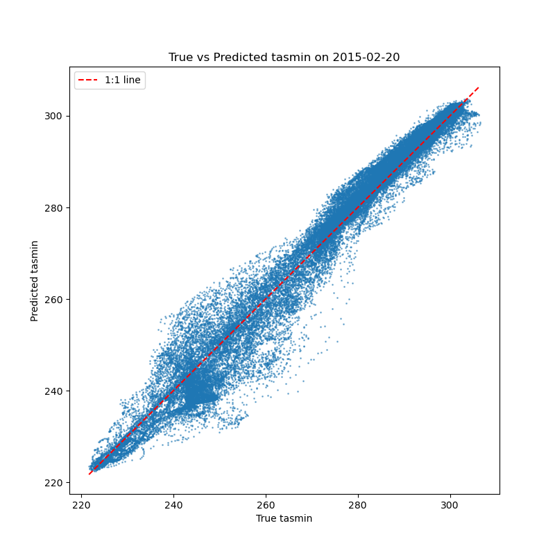</td>
<td></td>
  </tr>
</table>

#### Other Visualizations

<table>
  <tr>
<td align="center"><b>index_map_CDD_2065-01-01.png</b></td>
<td align="center"><b>index_map_CSDI_2065-01-01.png</b></td>
  </tr>
  <tr>
<td>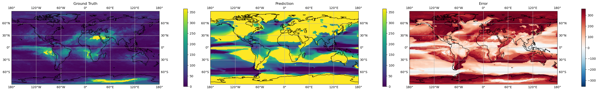</td>
<td>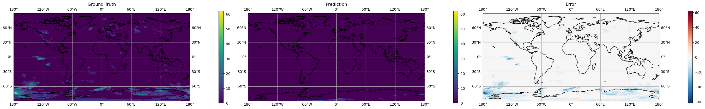</td>
  </tr>
  <tr>
<td align="center"><b>index_map_CWD_2065-01-01.png</b></td>
<td align="center"><b>index_map_FD_2065-01-01.png</b></td>
  </tr>
  <tr>
<td>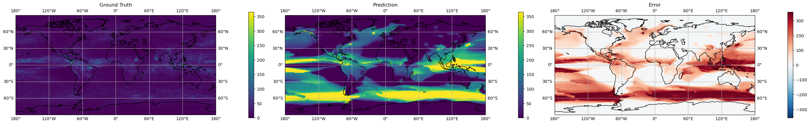</td>
<td>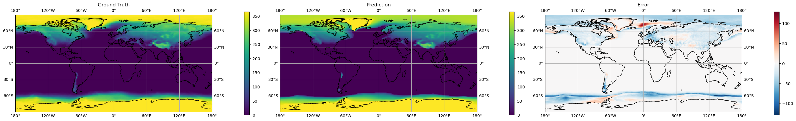</td>
  </tr>
  <tr>
<td align="center"><b>index_map_GSL_2065-01-01.png</b></td>
<td align="center"><b>index_map_ID_2065-01-01.png</b></td>
  </tr>
  <tr>
<td>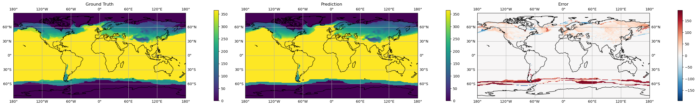</td>
<td>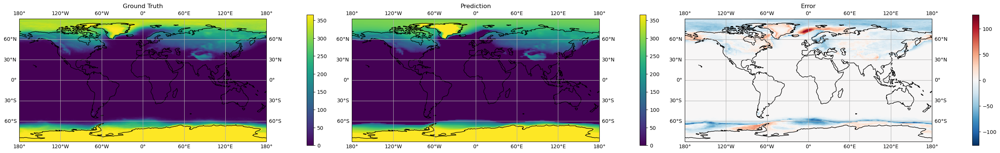</td>
  </tr>
  <tr>
<td align="center"><b>index_map_R10mm_2065-01-01.png</b></td>
<td align="center"><b>index_map_R95p_2065-01-01.png</b></td>
  </tr>
  <tr>
<td>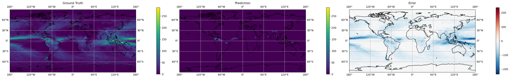</td>
<td>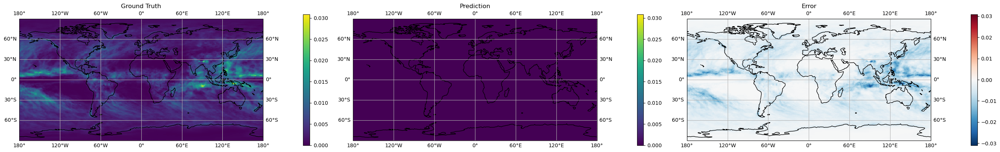</td>
  </tr>
  <tr>
<td align="center"><b>index_map_Rx5day_2019-03-01.png</b></td>
<td align="center"><b>index_map_SDII_2065-01-01.png</b></td>
  </tr>
  <tr>
<td>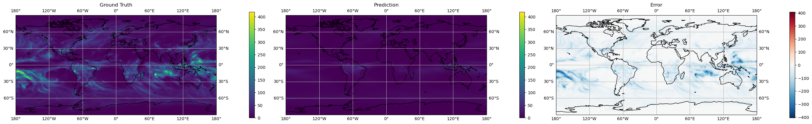</td>
<td>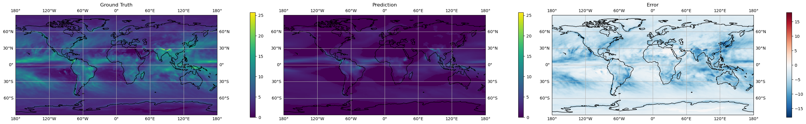</td>
  </tr>
  <tr>
<td align="center"><b>index_map_SU_2065-01-01.png</b></td>
<td align="center"><b>index_map_TNn_2019-03-01.png</b></td>
  </tr>
  <tr>
<td>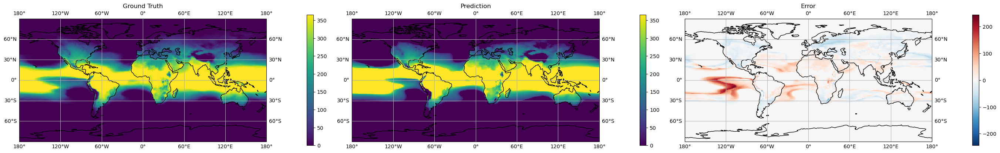</td>
<td>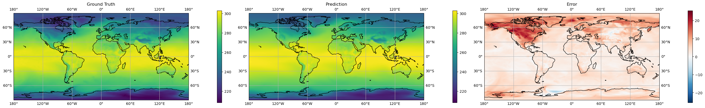</td>
  </tr>
  <tr>
<td align="center"><b>index_map_TR_2065-01-01.png</b></td>
<td align="center"><b>index_map_TXx_2019-03-01.png</b></td>
  </tr>
  <tr>
<td>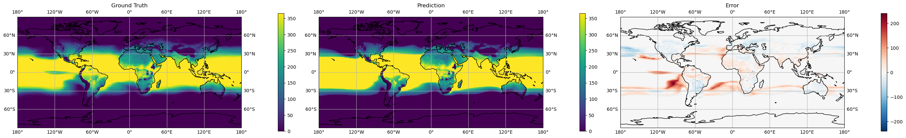</td>
<td>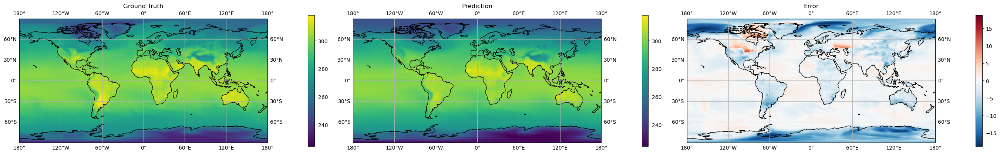</td>
  </tr>
  <tr>
<td align="center"><b>index_map_WSDI_2065-01-01.png</b></td>
<td align="center"><b>index_timeseries_CDD_40.0_-95.0.png</b></td>
  </tr>
  <tr>
<td>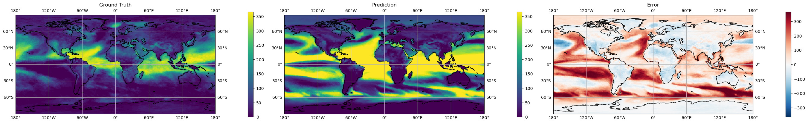</td>
<td></td>
  </tr>
  <tr>
<td align="center"><b>index_timeseries_CSDI_40.0_-95.0.png</b></td>
<td align="center"><b>index_timeseries_CWD_40.0_-95.0.png</b></td>
  </tr>
  <tr>
<td></td>
<td>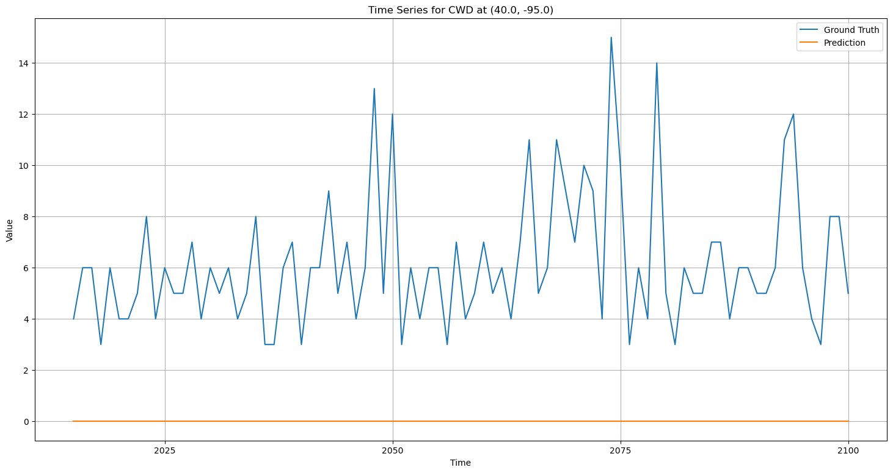</td>
  </tr>
  <tr>
<td align="center"><b>index_timeseries_FD_40.0_-95.0.png</b></td>
<td align="center"><b>index_timeseries_GSL_40.0_-95.0.png</b></td>
  </tr>
  <tr>
<td>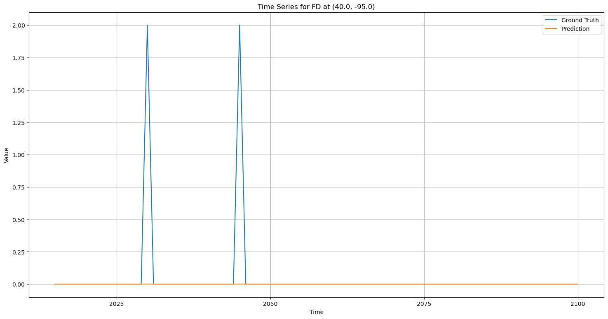</td>
<td></td>
  </tr>
  <tr>
<td align="center"><b>index_timeseries_ID_40.0_-95.0.png</b></td>
<td align="center"><b>index_timeseries_R10mm_40.0_-95.0.png</b></td>
  </tr>
  <tr>
<td>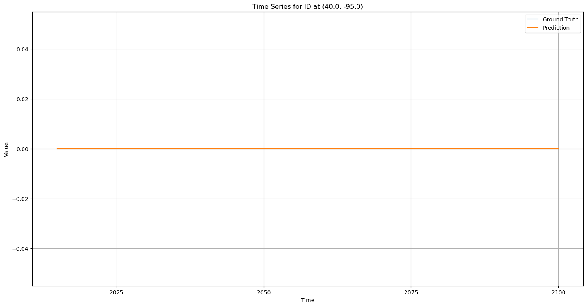</td>
<td></td>
  </tr>
  <tr>
<td align="center"><b>index_timeseries_R95p_40.0_-95.0.png</b></td>
<td align="center"><b>index_timeseries_Rx5day_40.0_-95.0.png</b></td>
  </tr>
  <tr>
<td></td>
<td>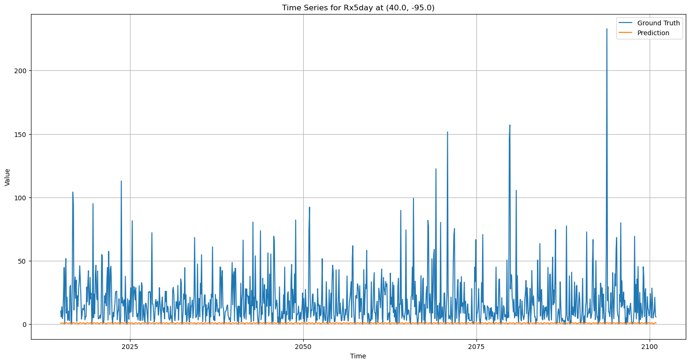</td>
  </tr>
  <tr>
<td align="center"><b>index_timeseries_SDII_40.0_-95.0.png</b></td>
<td align="center"><b>index_timeseries_SU_40.0_-95.0.png</b></td>
  </tr>
  <tr>
<td>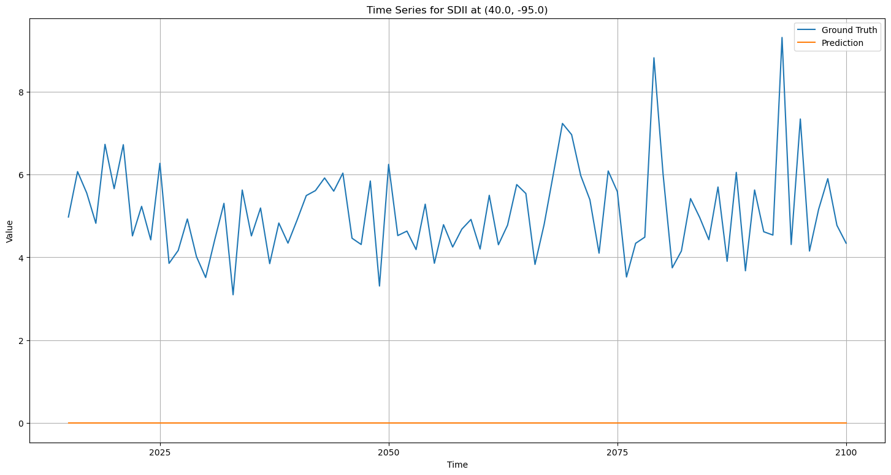</td>
<td>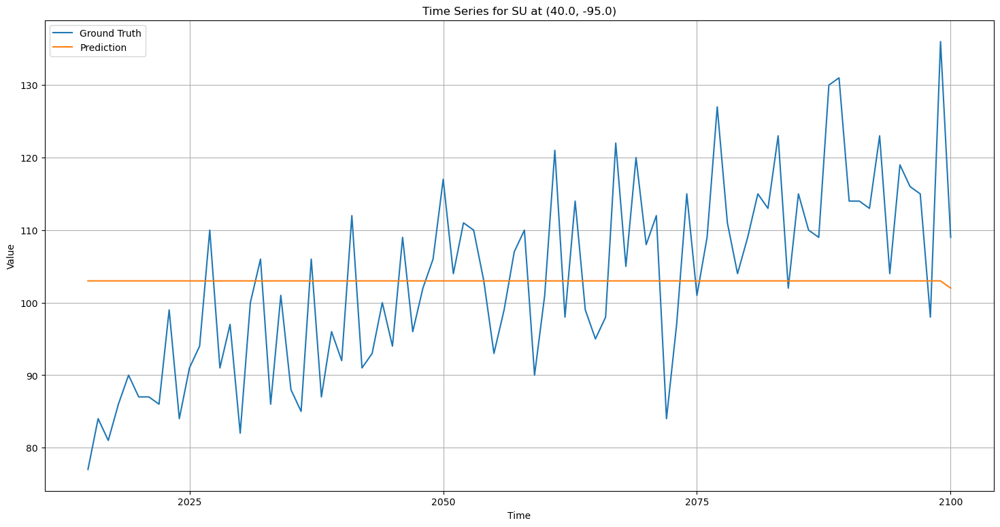</td>
  </tr>
  <tr>
<td align="center"><b>index_timeseries_TNn_40.0_-95.0.png</b></td>
<td align="center"><b>index_timeseries_TR_40.0_-95.0.png</b></td>
  </tr>
  <tr>
<td>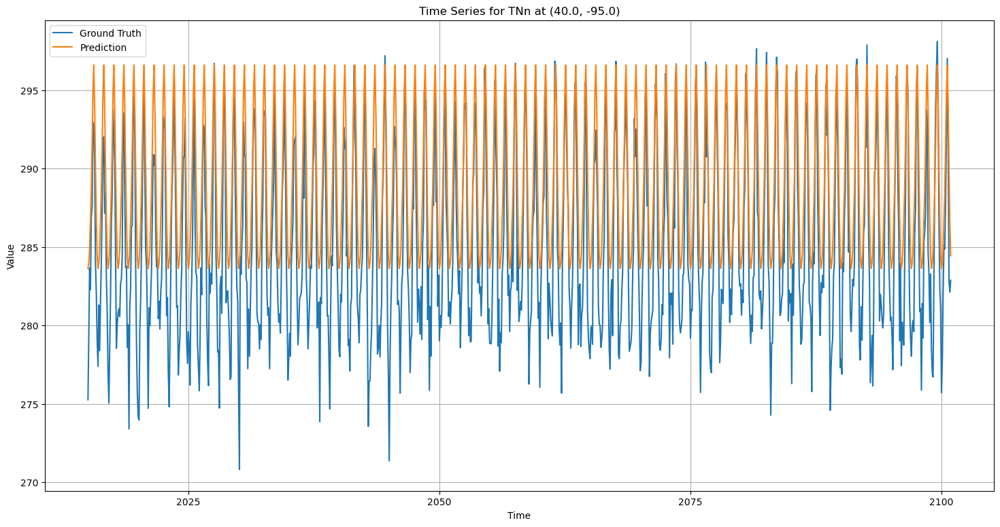</td>
<td>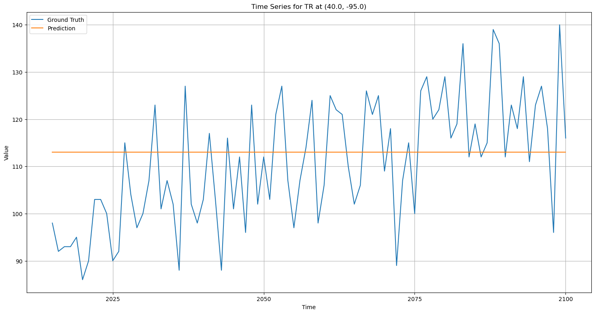</td>
  </tr>
  <tr>
<td align="center"><b>index_timeseries_TXx_40.0_-95.0.png</b></td>
<td align="center"><b>index_timeseries_WSDI_40.0_-95.0.png</b></td>
  </tr>
  <tr>
<td>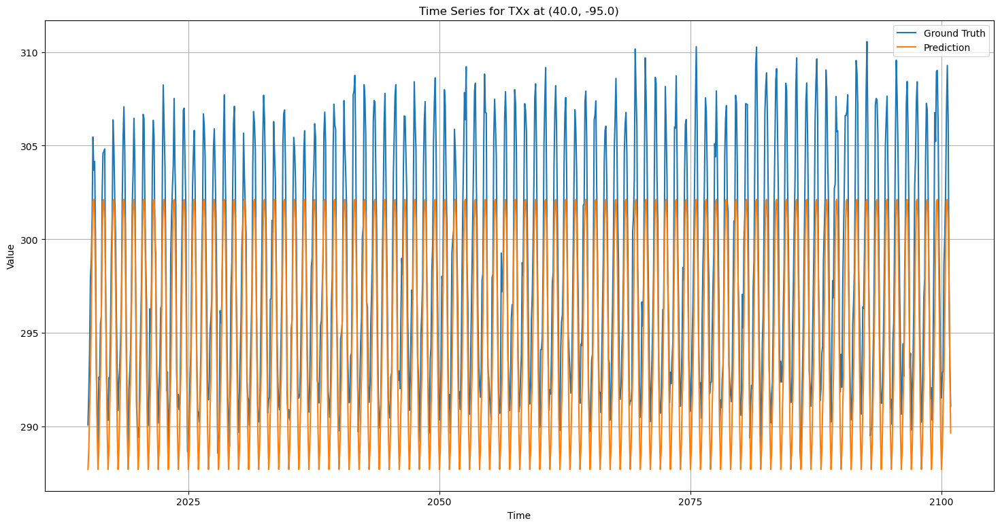</td>
<td>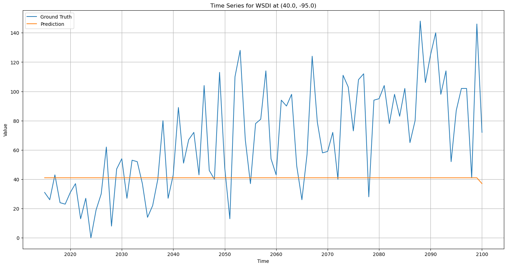</td>
  </tr>
</table>
