# Nn Baseline Model Results

Here are the latest results after running the baseline nn model on the `ssp245` test scenario.

### Kaggle Score

| Metric | Score |
|---|---|
| nNSE (↑) | -0.466356 |

### Quantitative Results

| Variable                             |     R² |
|:-------------------------------------|-------:|
| `tas` (Near-Surface Air Temperature) |  0.662 |
| `tasmax` (Daily Max Temperature)     |  0.642 |
| `tasmin` (Daily Min Temperature)     |  0.657 |
| `pr` (Precipitation)                 | -0.082 |
| `huss` (Specific Humidity)           |  0.557 |
| `psl` (Sea Level Pressure)           |  0.205 |
| `sfcWind` (Surface Wind Speed)       |  0.125 |

**Climate Extreme Indices Metrics:**

| Index   | Description                   | Unit     | RMSE           |       R2 |
|:--------|:------------------------------|:---------|:---------------|---------:|
| FD      | Frost Days                    | days     | 8.098 days     |   -1.294 |
| SU      | Summer Days (Tmax ≥ 25°C)     | days     | 9.172 days     |   -0.248 |
| ID      | Ice Days (Tmax < 0°C)         | days     | 8.472 days     |   -1.174 |
| TR      | Tropical Nights (Tmin ≥ 20°C) | days     | 7.390 days     |   -0.119 |
| GSL     | Growing Season Length         | days     | 9.183 days     |    0.298 |
| TXX     | Monthly Max of Daily Tmax     | °C       | 3.816 °C       |   -0.606 |
| TNN     | Monthly Min of Daily Tmin     | °C       | 4.215 °C       |    0.034 |
| WSDI    | Warm Spell Duration Index     | days     | 58.704 days    |   -1.922 |
| CSDI    | Cold Spell Duration Index     | days     | 3.311 days     |   -0.112 |
| RX5DAY  | Max 5-day Precipitation       | mm       | 34.615 mm      |   -2.165 |
| CDD     | Consecutive Dry Days          | days     | 204.257 days   | -921.49  |
| CWD     | Consecutive Wet Days          | days     | 83.093 days    | -544.811 |
| R95P    | Total Precip above 95th pct   | mm       | 330.372 mm     |   -9.783 |
| SDII    | Simple Daily Intensity Index  | mm day⁻¹ | 4.457 mm day⁻¹ |  -62.973 |
| R10MM   | Days with Precip ≥10mm        | days     | 22.563 days    |  -11.757 |

### Visual Results

The visualizations for spatial maps and time series comparisons are generated within the `playground.ipynb` notebook. Below are all visuals from `nn_visuals/`.
#### Spatial Comparison Maps

<table>
  <tr>
<td align="center"><b>result_map_huss_2015-02-20.png</b></td>
<td align="center"><b>result_map_pr_2015-02-20.png</b></td>
  </tr>
  <tr>
<td>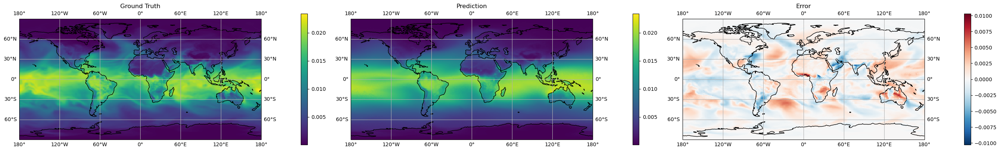</td>
<td>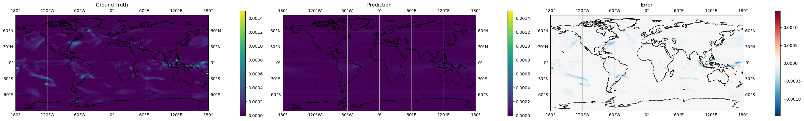</td>
  </tr>
  <tr>
<td align="center"><b>result_map_psl_2015-02-20.png</b></td>
<td align="center"><b>result_map_sfcWind_2015-02-20.png</b></td>
  </tr>
  <tr>
<td>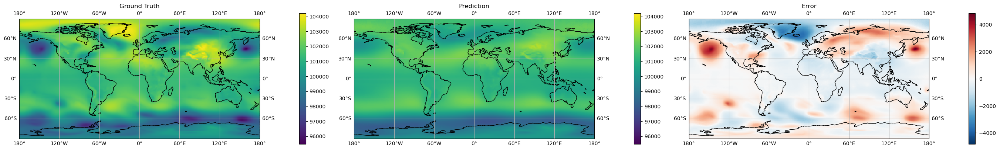</td>
<td>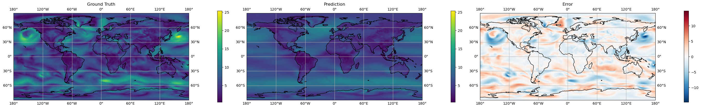</td>
  </tr>
  <tr>
<td align="center"><b>result_map_tas_2015-02-20.png</b></td>
<td align="center"><b>result_map_tasmax_2015-02-20.png</b></td>
  </tr>
  <tr>
<td>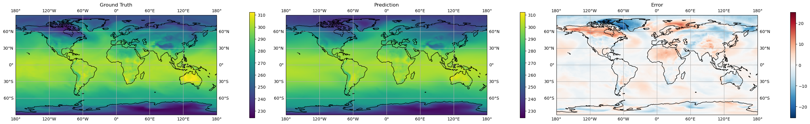</td>
<td>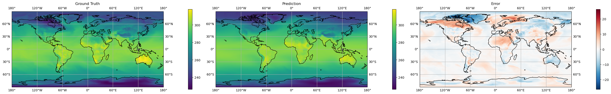</td>
  </tr>
  <tr>
<td align="center"><b>result_map_tasmin_2015-02-20.png</b></td>
<td align="center"></td>
  </tr>
  <tr>
<td>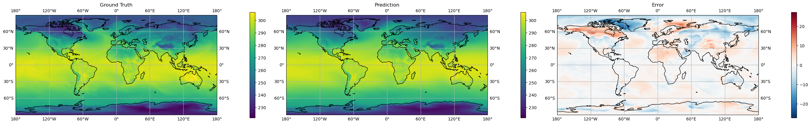</td>
<td></td>
  </tr>
</table>

#### Time Series Comparisons

<table>
  <tr>
<td align="center"><b>result_timeseries_huss_40.0_-95.0.png</b></td>
<td align="center"><b>result_timeseries_pr_40.0_-95.0.png</b></td>
  </tr>
  <tr>
<td>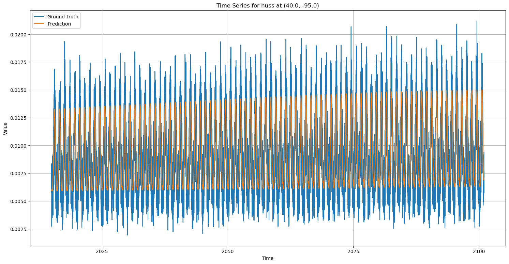</td>
<td>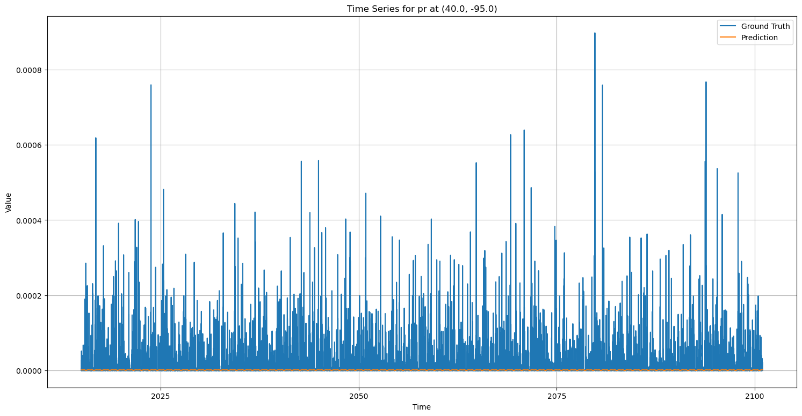</td>
  </tr>
  <tr>
<td align="center"><b>result_timeseries_psl_40.0_-95.0.png</b></td>
<td align="center"><b>result_timeseries_sfcWind_40.0_-95.0.png</b></td>
  </tr>
  <tr>
<td>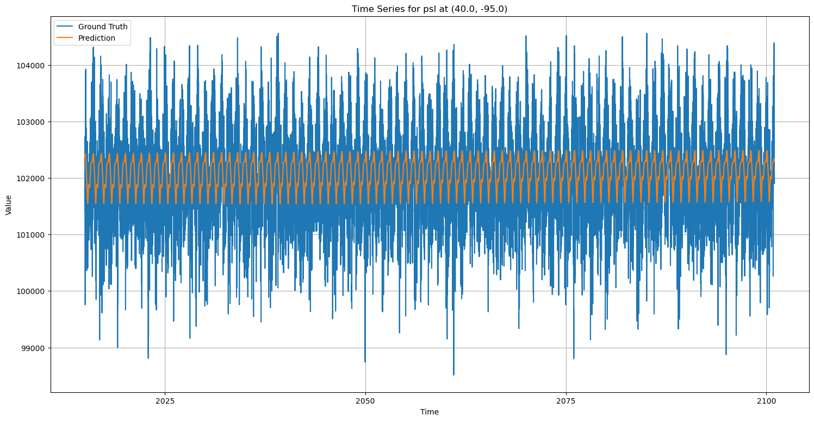</td>
<td>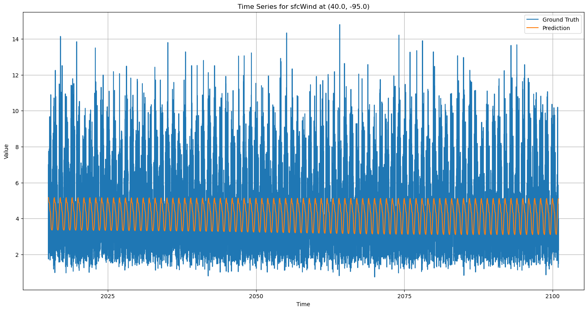</td>
  </tr>
  <tr>
<td align="center"><b>result_timeseries_tas_40.0_-95.0.png</b></td>
<td align="center"><b>result_timeseries_tasmax_40.0_-95.0.png</b></td>
  </tr>
  <tr>
<td>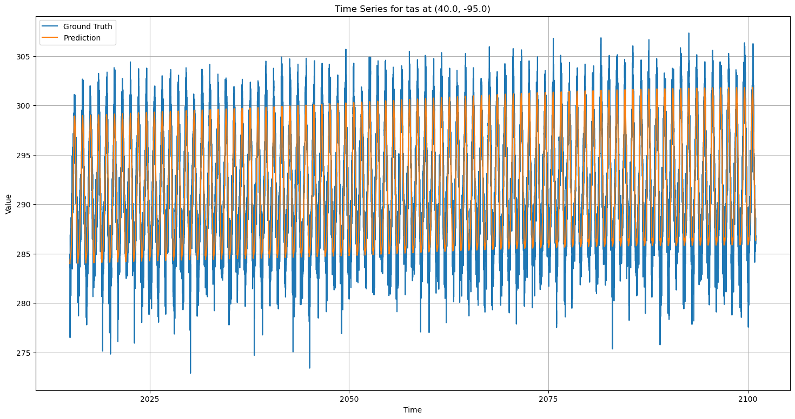</td>
<td>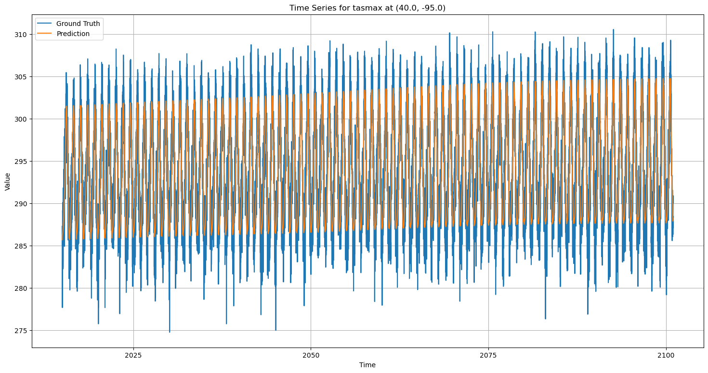</td>
  </tr>
  <tr>
<td align="center"><b>result_timeseries_tasmin_40.0_-95.0.png</b></td>
<td align="center"></td>
  </tr>
  <tr>
<td>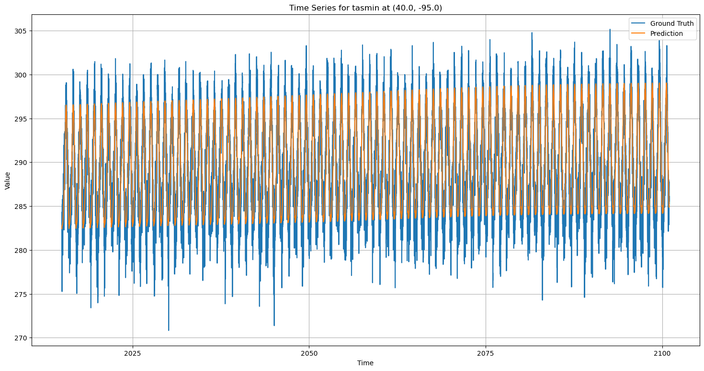</td>
<td></td>
  </tr>
</table>

#### Scatter Plots

<table>
  <tr>
<td align="center"><b>result_scatter_huss_2015-02-20.png</b></td>
<td align="center"><b>result_scatter_pr_2015-02-20.png</b></td>
  </tr>
  <tr>
<td>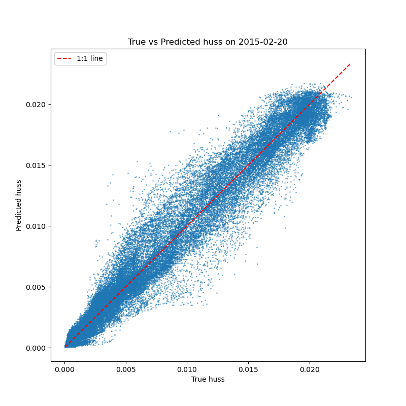</td>
<td>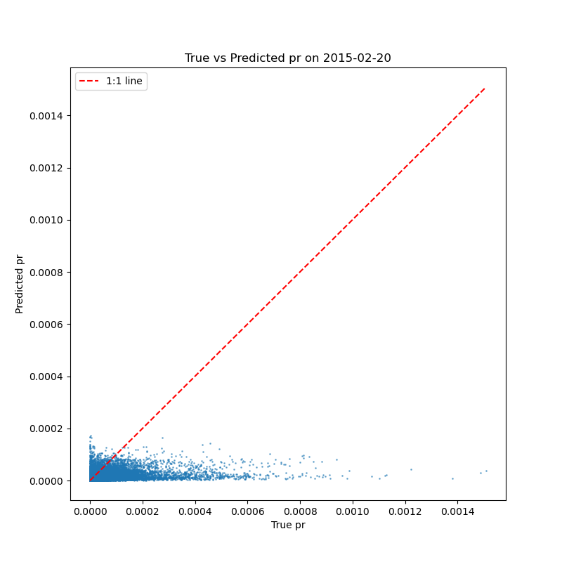</td>
  </tr>
  <tr>
<td align="center"><b>result_scatter_psl_2015-02-20.png</b></td>
<td align="center"><b>result_scatter_sfcWind_2015-02-20.png</b></td>
  </tr>
  <tr>
<td>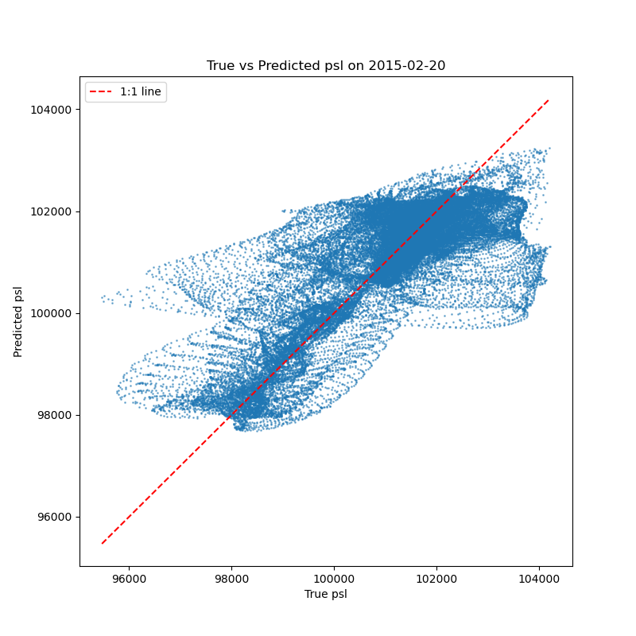</td>
<td>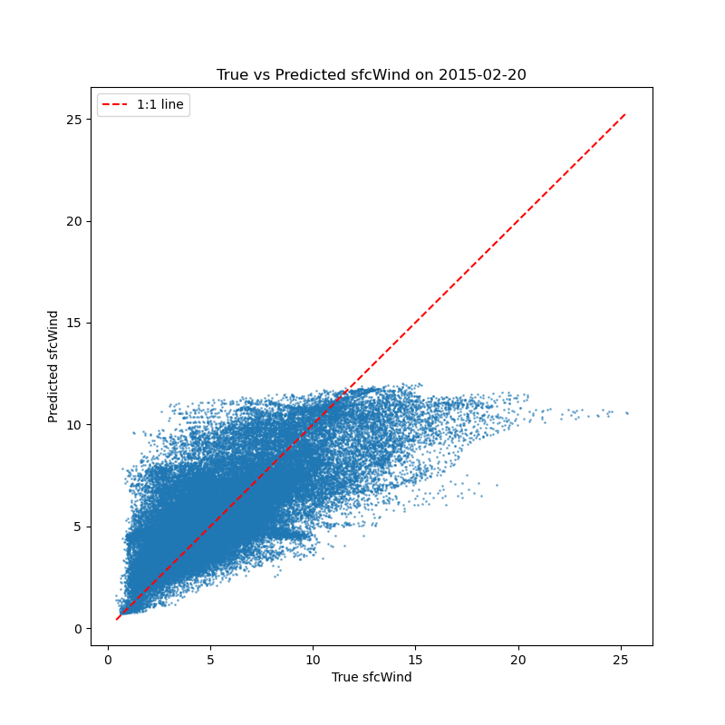</td>
  </tr>
  <tr>
<td align="center"><b>result_scatter_tas_2015-02-20.png</b></td>
<td align="center"><b>result_scatter_tasmax_2015-02-20.png</b></td>
  </tr>
  <tr>
<td>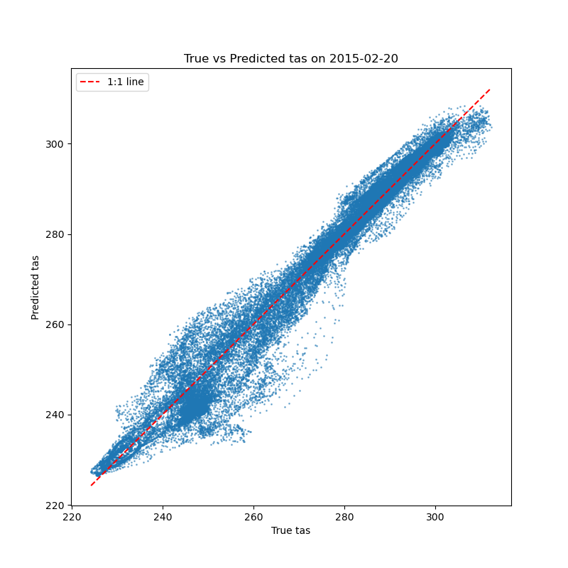</td>
<td>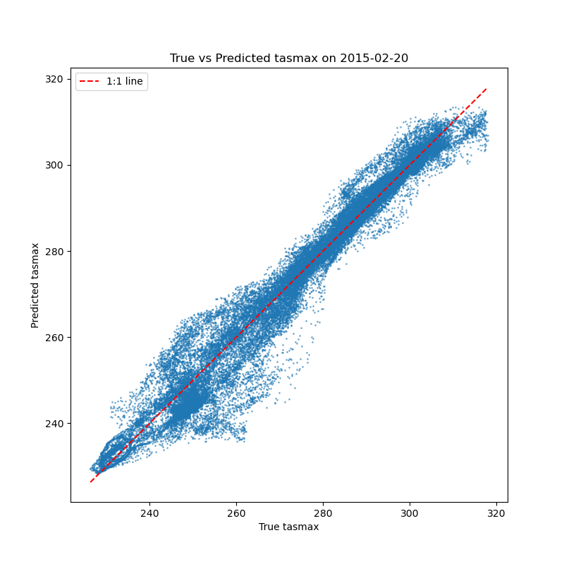</td>
  </tr>
  <tr>
<td align="center"><b>result_scatter_tasmin_2015-02-20.png</b></td>
<td align="center"></td>
  </tr>
  <tr>
<td>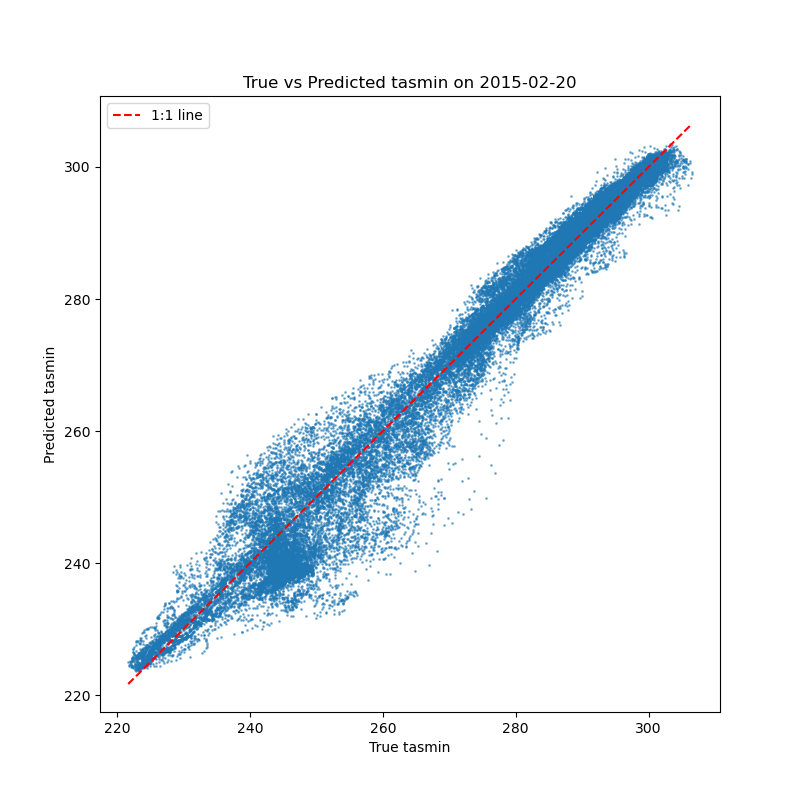</td>
<td></td>
  </tr>
</table>

#### Other Visualizations

<table>
  <tr>
<td align="center"><b>index_map_CDD_2065-01-01.png</b></td>
<td align="center"><b>index_map_CSDI_2065-01-01.png</b></td>
  </tr>
  <tr>
<td>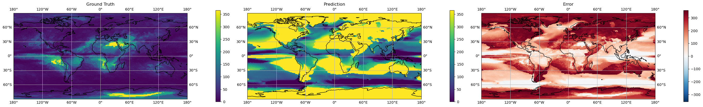</td>
<td>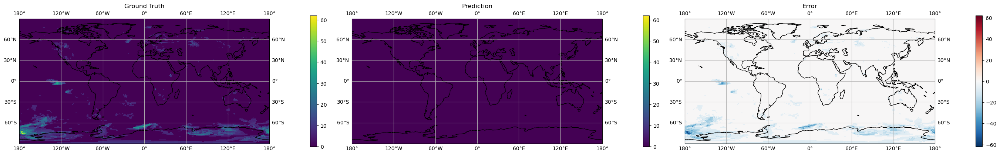</td>
  </tr>
  <tr>
<td align="center"><b>index_map_CWD_2065-01-01.png</b></td>
<td align="center"><b>index_map_FD_2065-01-01.png</b></td>
  </tr>
  <tr>
<td>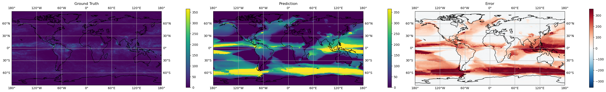</td>
<td>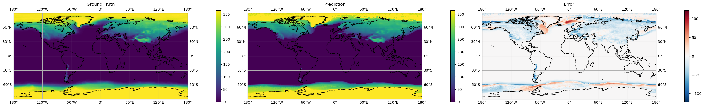</td>
  </tr>
  <tr>
<td align="center"><b>index_map_GSL_2065-01-01.png</b></td>
<td align="center"><b>index_map_ID_2065-01-01.png</b></td>
  </tr>
  <tr>
<td>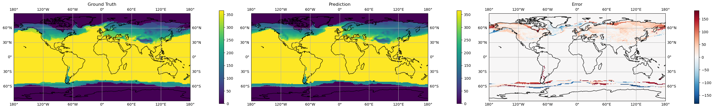</td>
<td>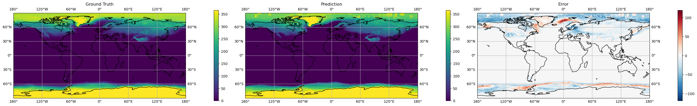</td>
  </tr>
  <tr>
<td align="center"><b>index_map_R10mm_2065-01-01.png</b></td>
<td align="center"><b>index_map_R95p_2065-01-01.png</b></td>
  </tr>
  <tr>
<td>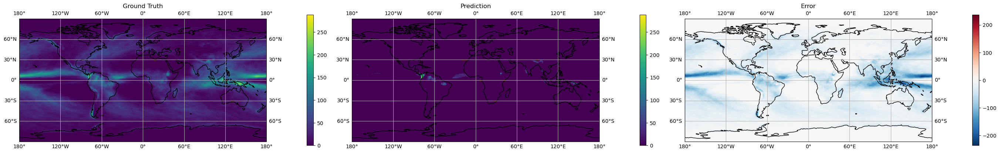</td>
<td>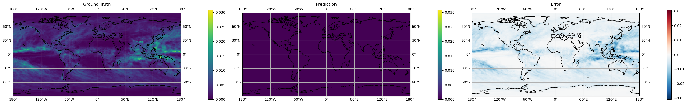</td>
  </tr>
  <tr>
<td align="center"><b>index_map_Rx5day_2019-03-01.png</b></td>
<td align="center"><b>index_map_SDII_2065-01-01.png</b></td>
  </tr>
  <tr>
<td>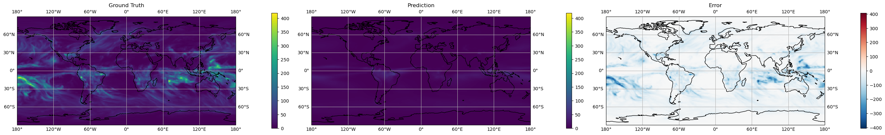</td>
<td>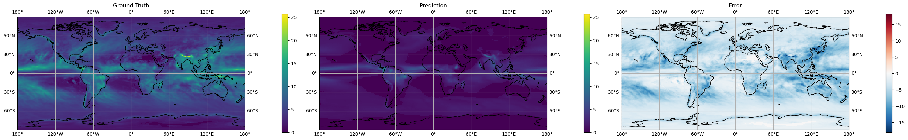</td>
  </tr>
  <tr>
<td align="center"><b>index_map_SU_2065-01-01.png</b></td>
<td align="center"><b>index_map_TNn_2019-03-01.png</b></td>
  </tr>
  <tr>
<td>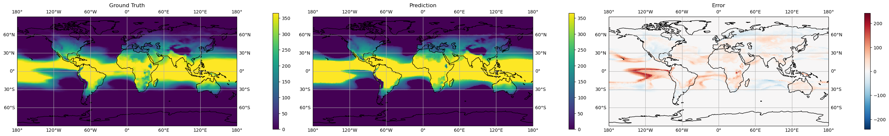</td>
<td>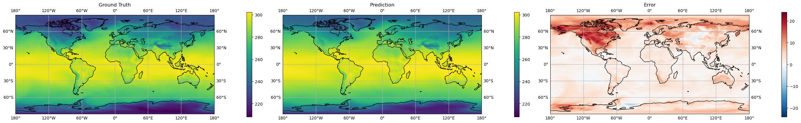</td>
  </tr>
  <tr>
<td align="center"><b>index_map_TR_2065-01-01.png</b></td>
<td align="center"><b>index_map_TXx_2019-03-01.png</b></td>
  </tr>
  <tr>
<td>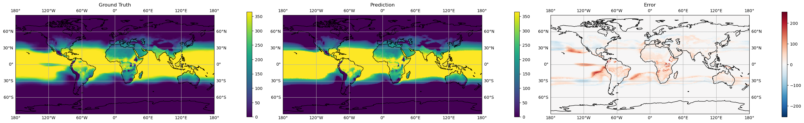</td>
<td>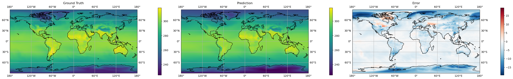</td>
  </tr>
  <tr>
<td align="center"><b>index_map_WSDI_2065-01-01.png</b></td>
<td align="center"><b>index_timeseries_CDD_40.0_-95.0.png</b></td>
  </tr>
  <tr>
<td>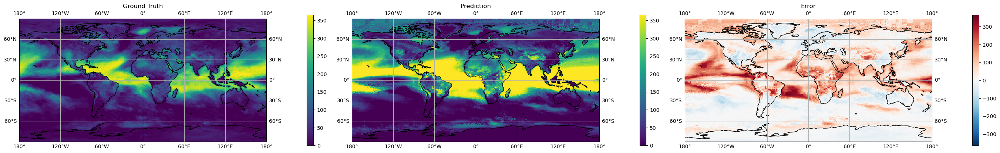</td>
<td></td>
  </tr>
  <tr>
<td align="center"><b>index_timeseries_CSDI_40.0_-95.0.png</b></td>
<td align="center"><b>index_timeseries_CWD_40.0_-95.0.png</b></td>
  </tr>
  <tr>
<td></td>
<td></td>
  </tr>
  <tr>
<td align="center"><b>index_timeseries_FD_40.0_-95.0.png</b></td>
<td align="center"><b>index_timeseries_GSL_40.0_-95.0.png</b></td>
  </tr>
  <tr>
<td></td>
<td>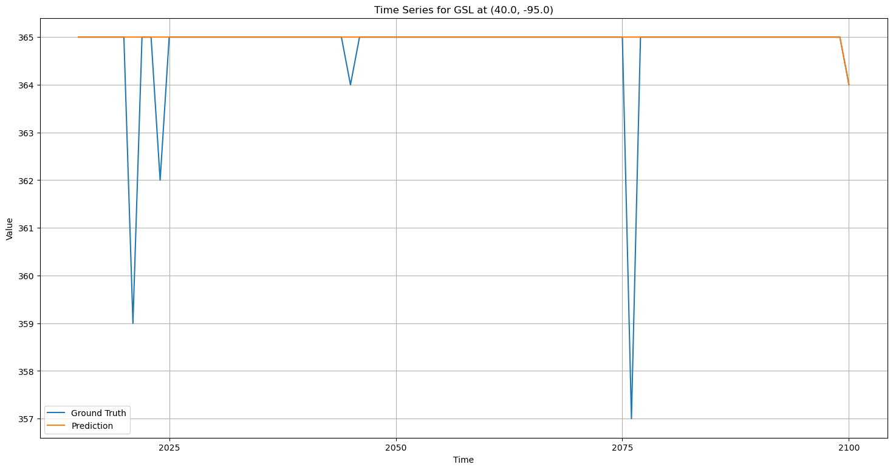</td>
  </tr>
  <tr>
<td align="center"><b>index_timeseries_ID_40.0_-95.0.png</b></td>
<td align="center"><b>index_timeseries_R10mm_40.0_-95.0.png</b></td>
  </tr>
  <tr>
<td></td>
<td>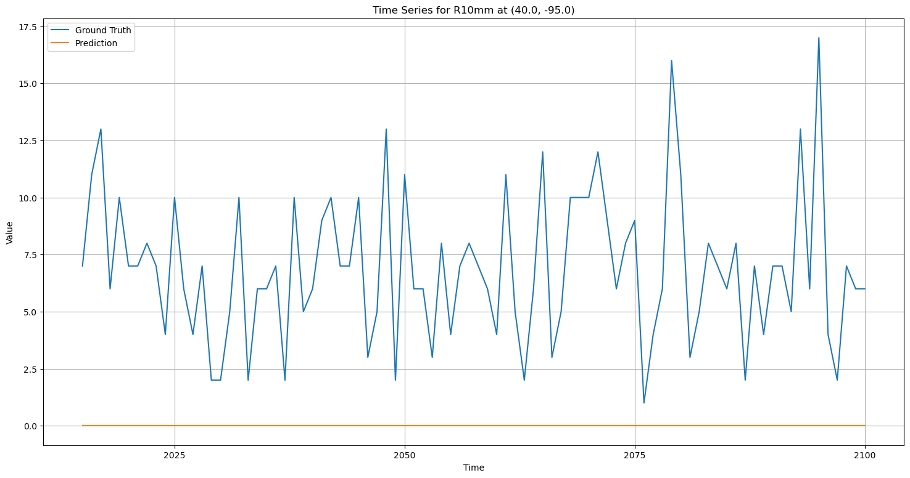</td>
  </tr>
  <tr>
<td align="center"><b>index_timeseries_R95p_40.0_-95.0.png</b></td>
<td align="center"><b>index_timeseries_Rx5day_40.0_-95.0.png</b></td>
  </tr>
  <tr>
<td></td>
<td>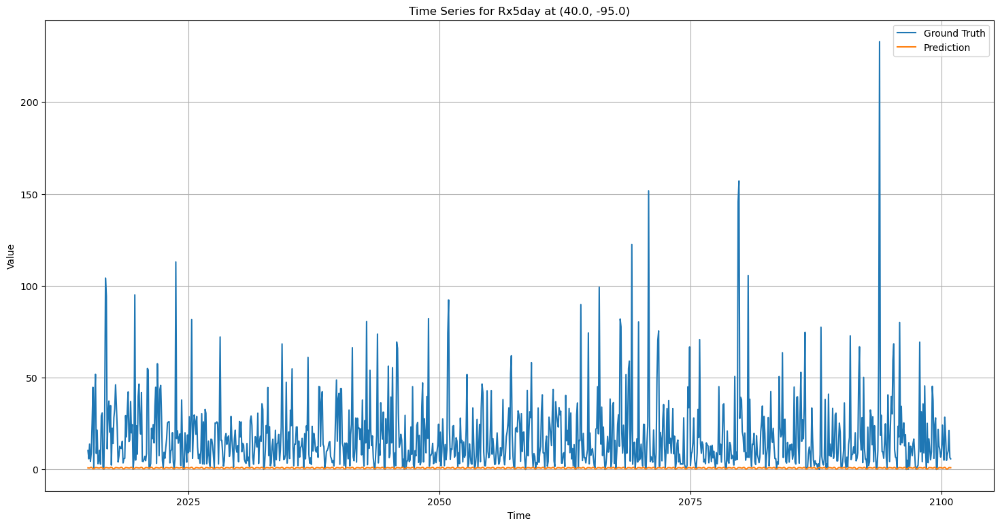</td>
  </tr>
  <tr>
<td align="center"><b>index_timeseries_SDII_40.0_-95.0.png</b></td>
<td align="center"><b>index_timeseries_SU_40.0_-95.0.png</b></td>
  </tr>
  <tr>
<td></td>
<td>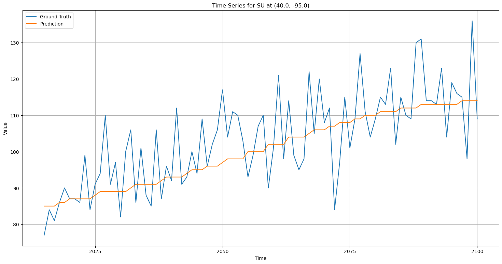</td>
  </tr>
  <tr>
<td align="center"><b>index_timeseries_TNn_40.0_-95.0.png</b></td>
<td align="center"><b>index_timeseries_TR_40.0_-95.0.png</b></td>
  </tr>
  <tr>
<td>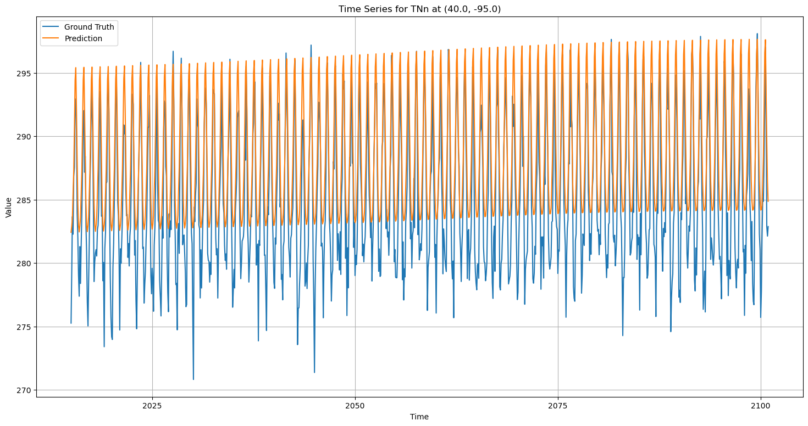</td>
<td>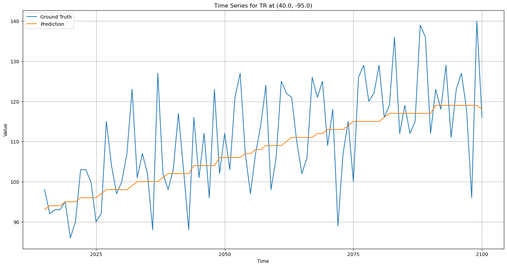</td>
  </tr>
  <tr>
<td align="center"><b>index_timeseries_TXx_40.0_-95.0.png</b></td>
<td align="center"><b>index_timeseries_WSDI_40.0_-95.0.png</b></td>
  </tr>
  <tr>
<td>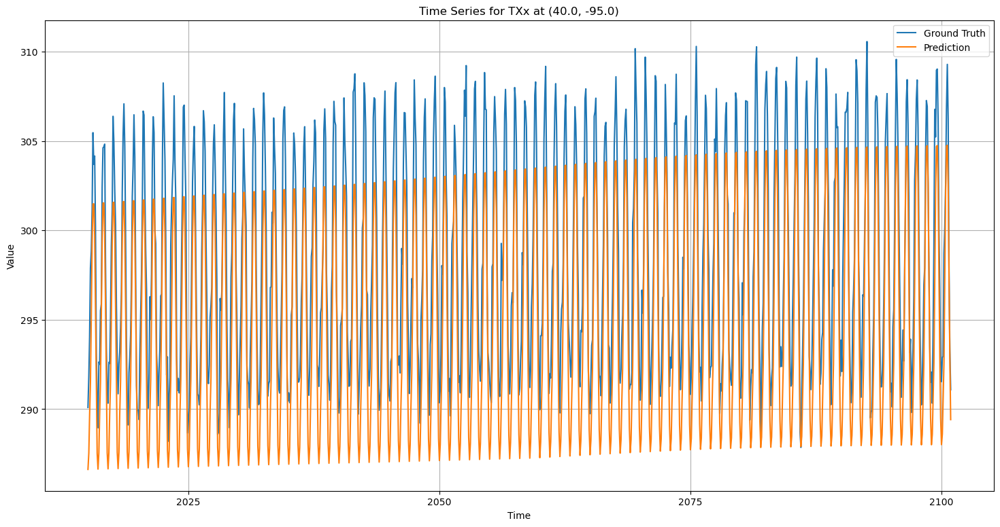</td>
<td>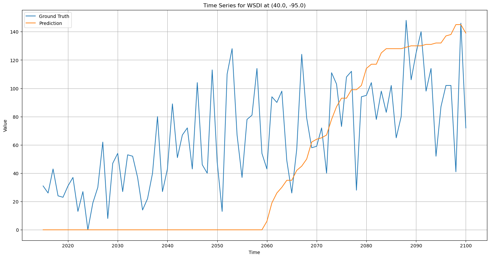</td>
  </tr>
</table>
